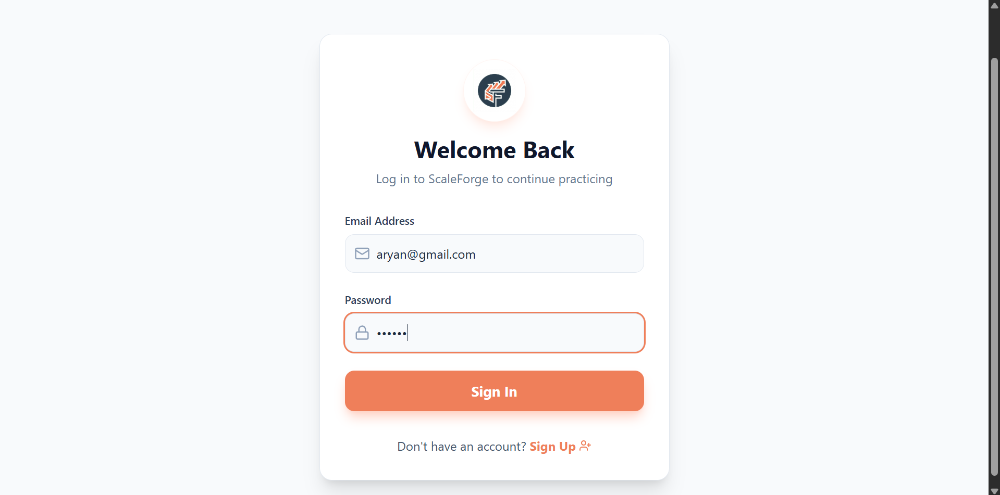
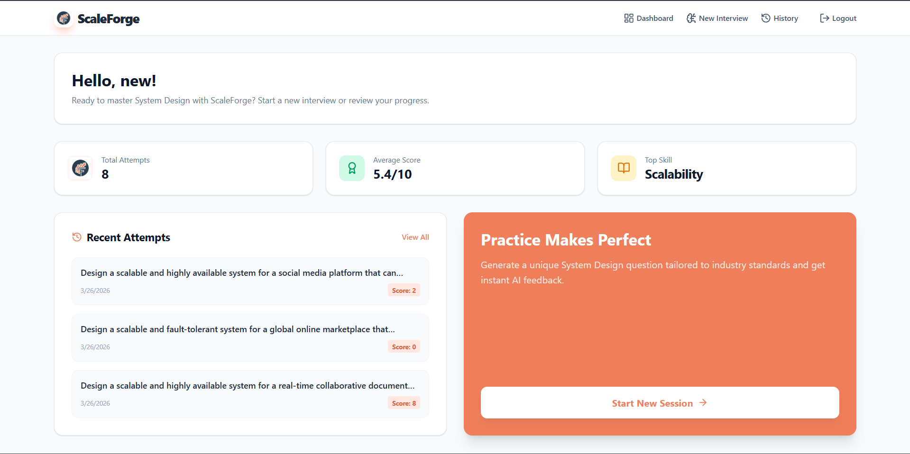
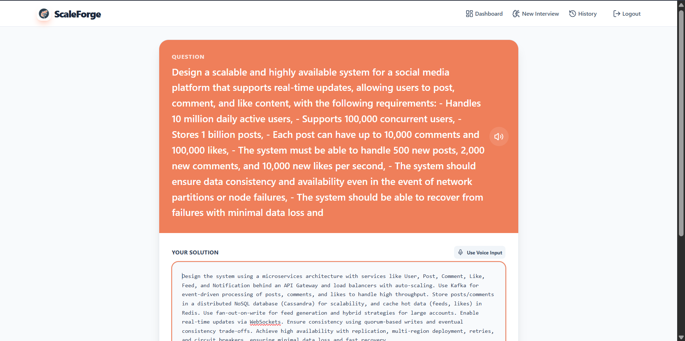
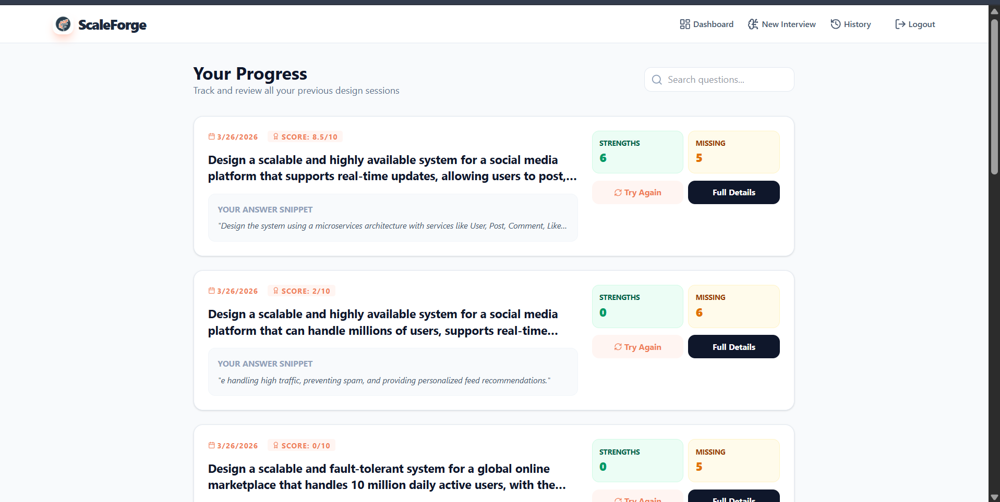
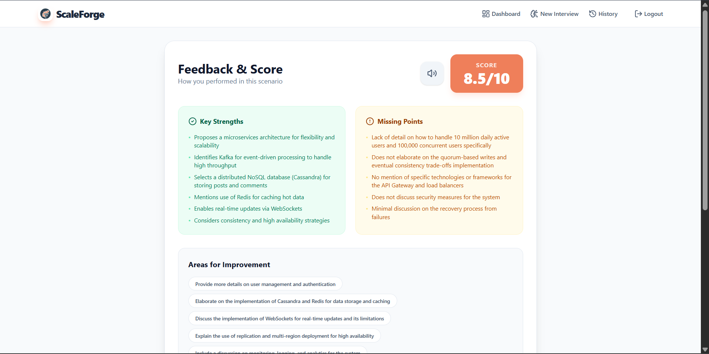

# <h1 align="center">🏗 ScaleForge</h1>

<p align="center">
  A Professional AI-Powered System Design Interview Simulator (MERN + Groq)
</p>

<p align="center">
  <a href="https://scale-forge-omega.vercel.app" target="_blank">
    
  </a>
  <a href="https://scaleforge-backend.onrender.com" target="_blank">
    
  </a>
</p>

---

## 🚀 Overview

ScaleForge is an immersive practice platform designed to help engineers master High-Level Architecture (HLA) and System Design interviews. Using advanced LLMs (Llama 3.3 70B via Groq), it provides:

- 🧠 **Dynamic Scenarios**: Challenging, industry-standard system design prompts.
- 💬 **Intelligent Evaluation**: Instant, detailed feedback on your solutions.
- 📊 **Performance Tracking**: Score-based metrics and historical progress.
- 🔐 **Secure Access**: JWT-based authentication for private practice sessions.

---

## 🧠 Tech Stack

### 🖥 Frontend
- **React.js** (Vite)
- **Tailwind CSS** (Styling)
- **Framer Motion** (Animations)
- **Lucide React** (Icons)
- **React Router** (Navigation)

### ⚙ Backend
- **Node.js & Express.js**
- **MongoDB Atlas** (Database)
- **Groq API** (Llama-3.3-70b-versatile)
- **JWT Authentication**
- **Axios** (API Requests)

---

## 🏗 System Architecture
**User Interface (React)**  
→  
**API Gateway (Express)**  
→  
**Inference Engine (Groq / Llama 3.3)**  
→  
**Data Layer (MongoDB Atlas)**

---

## 🔐 Key Features

✔ **AI-Generated Questions**: Fresh, context-aware design scenarios every time.  
✔ **Deep Feedback**: Detailed breakdown of Strengths, Missing Points, and Improvements.  
✔ **Weighted Scoring**: Performance metrics out of 10 based on architectural principles.  
✔ **Session History**: Review previous interviews to visualize your growth.  
✔ **Production Ready**: Optimized for deployment on Vercel and Render.  

---

## 🌍 Live Deployment

🔗 **Frontend (Vercel):**  
[https://scale-forge-omega.vercel.app](https://scale-forge-omega.vercel.app)  

🔗 **Backend (Render):**  
[https://scaleforge-backend.onrender.com](https://scaleforge-backend.onrender.com)  

---

## ⚙️ Local Setup

### Clone Repository
```bash
git clone https://github.com/aryan9855/ScaleForge.git
cd ScaleForge
```

### Backend Setup
```bash
cd backend
npm install
npm run dev
```

### Frontend Setup
```bash
cd frontend
npm install
npm run dev
```

---

## 📸 Screenshots

### 🏠 Login
<p align="center">
  
</p>

### 🧠 Dashboard
<p align="center">
  
</p>

### 📊 Interview Session
<p align="center">
  
</p>

### 🕒 History & Progress
<p align="center">
  
</p>

### 🕒 Result
<p align="center">
  
</p>

---

👨‍💻 **Developer**

**Aryan Singhal**  
Full-Stack MERN Developer  
Passionate about scalable web applications and AI integration 🚀