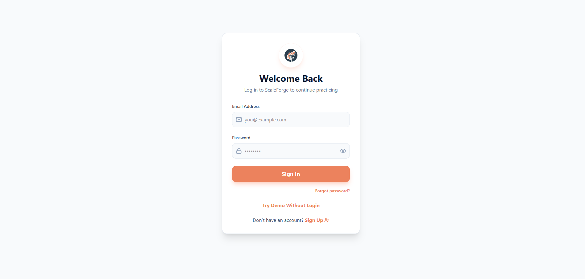
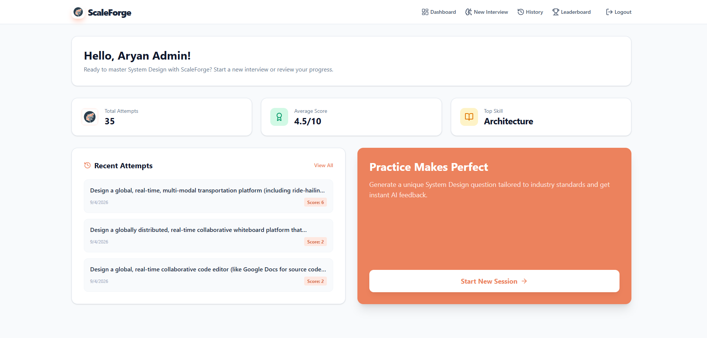
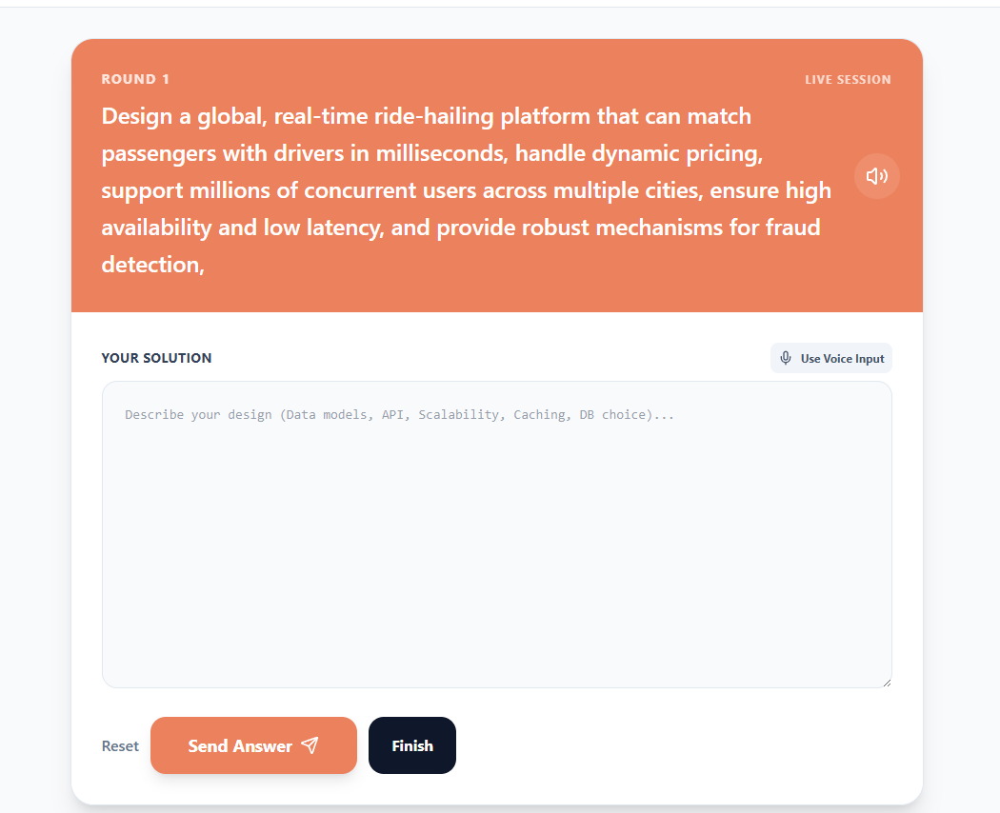
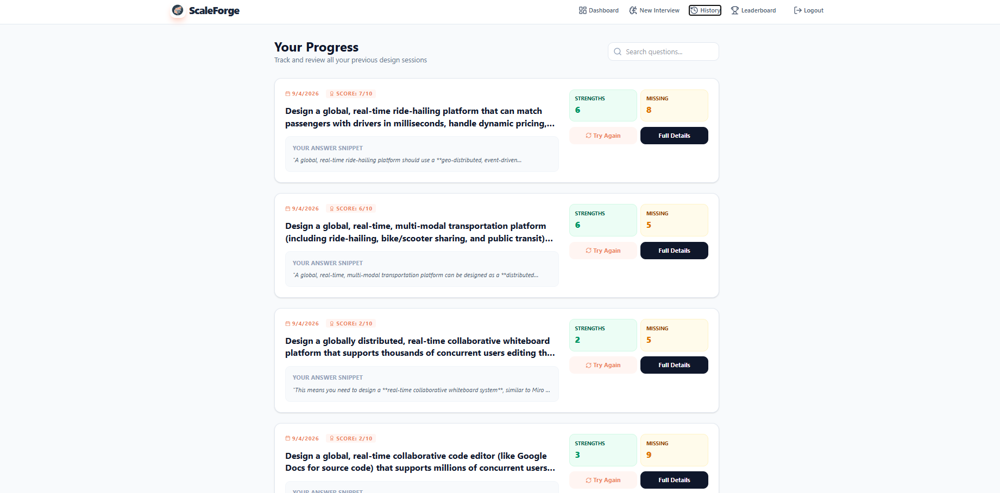
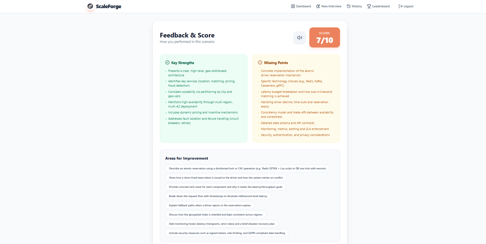

# <h1 align="center">ScaleForge AI</h1>

<p align="center">
  A GenAI-powered system design interview simulator for realistic, multi-round practice
</p>

<p align="center">
  <a href="https://scale-forge-omega.vercel.app" target="_blank">
    
  </a>
  <a href="https://scaleforge-backend.onrender.com" target="_blank">
    
  </a>
</p>

---

## Overview

ScaleForge AI helps software engineers practice system design interviews through an interactive AI interviewer. It maintains conversation context across multiple rounds, asks relevant follow-up questions, and evaluates each response with structured feedback.

- **Context-aware interviews:** GPT-OSS 120B generates interview questions and follow-ups through the Groq API.
- **Structured evaluation:** Responses receive a score from 0 to 10 with strengths, missing points, and improvement suggestions.
- **Progress tracking:** Completed interviews are stored for history, dashboard metrics, and leaderboard rankings.
- **Secure user accounts:** JWT authentication protects private interview data and supports password reset emails.

---

## Tech Stack

### 🖥 Frontend
- **React.js** (Vite)
- **Tailwind CSS**
- **Framer Motion**
- **Lucide React**
- **React Router**
- **Axios**
- **Socket.IO Client**

### ⚙ Backend
- **Node.js & Express.js**
- **MongoDB Atlas** with Mongoose (persistent data)
- **Redis** (temporary sessions and leaderboard sorted sets)
- **Groq API** with GPT-OSS 120B (AI inference)
- **JWT Authentication**
- **Socket.IO** (real-time leaderboard updates)
- **Nodemailer** (password reset emails)

### Development and Deployment
- **Docker Compose** (local Redis container)
- **Vercel** (frontend)
- **Render** (backend)

---

## System Architecture

```text
React + Vite frontend
  |
  v
Express REST API + Socket.IO
  |
  +--> Groq API / GPT-OSS 120B
  +--> Redis: active sessions and leaderboard rankings
  +--> MongoDB Atlas: users and completed attempts
```

---

## Key Features

- **AI-generated interview flow:** Start with a system design prompt and continue through dynamic follow-up questions.
- **Detailed scoring:** Receive feedback on architecture, scalability, trade-offs, communication, strengths, and improvement areas.
- **Temporary session state:** Redis stores active interview conversations with a one-hour expiration.
- **History and dashboard:** Review completed attempts and monitor average scores and progress.
- **Live leaderboard:** Redis rankings are broadcast to connected clients through Socket.IO.
- **Demo mode:** Try an interview before creating an account; demo results are not saved to history or the leaderboard.

---

## 🌍 Live Deployment

🔗 **Frontend (Vercel):**  
[https://scale-forge-omega.vercel.app](https://scale-forge-omega.vercel.app)  

🔗 **Backend (Render):**  
[https://scaleforge-backend.onrender.com](https://scaleforge-backend.onrender.com)  

---

## Local Setup

### Clone Repository
```bash
git clone https://github.com/aryan9855/ScaleForge.git
cd ScaleForge
```

### Start Redis with Docker Compose

```bash
docker compose up -d redis
```

The backend uses `REDIS_URL=redis://localhost:6379` when running on the host machine. MongoDB remains the persistent database and can be provided through MongoDB Atlas.

### Backend Setup
```bash
cd backend
npm install
npm run dev
```

### Frontend Setup
```bash
cd frontend
npm install
npm run dev
```

Configure the required environment variables before starting the backend. See [deployment.md](deployment.md) for MongoDB, Redis, JWT, Groq, frontend, Socket.IO, and SMTP configuration details.

---

## 📸 Screenshots

### 🏠 Login
<p align="center">
  
</p>

### 🧠 Dashboard
<p align="center">
  
</p>

### 📊 Interview Session
<p align="center">
  
</p>

### 🧠 LeaderBoard
<p align="center">
  
</p>

### 🕒 History & Progress
<p align="center">
  
</p>

### 🕒 Result
<p align="center">
  
</p>

---

## Developer

**Aryan Singhal**  
Full-Stack MERN Developer
